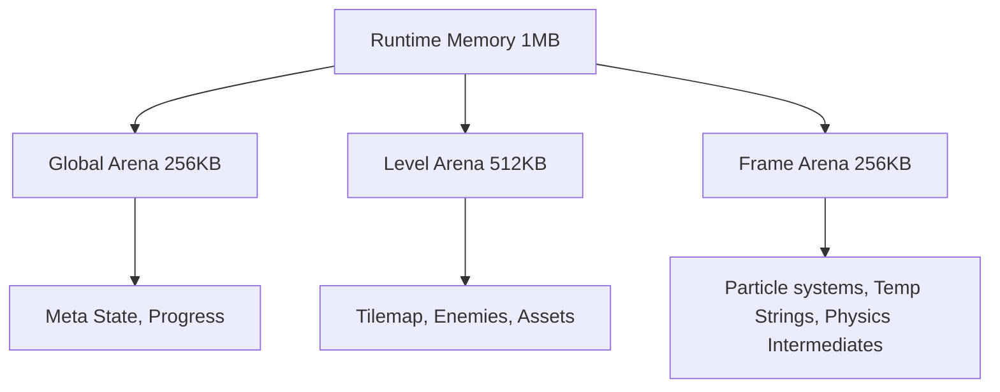

# bit-bound Architecture Overview

This document describes the high-level architecture of the `bit-bound` runtime.

## Core Loop

The runtime follows a classic game loop structure, executed 60 times per second:

1.  **Reset Frame Arena**: Clear all temporary per-frame allocations.
2.  **Poll Input**: Read raw input state from the simulated hardware components.
3.  **Update Game State**: Execute game logic (systems) using the `Global` and `Level` arenas for state storage.
4.  **Render**: Draw to the 160x144 4-color framebuffer.
5.  **Output**: Final composite displayed to the host screen.

## Memory Management

Memory is strictly partitioned into three distinct arenas to prevent leakages and ensure deterministic resource usage.

## Entity System

Entities are managed in fixed-capacity pools. There is no `Vec<Entity>`. Instead, we use `[Entity; MAX_ENTITIES]`.

- **Enemies**: Managed by the Level Arena.
- **Projectiles**: Managed by the Level Arena (or Frame Arena if transient).

## Hardware Simulation

The runtime abstracts host hardware into a simulated 90s-era console:
- **Input**: Bitmask representing D-pad and 4 buttons.
- **Screen**: 160x144 indexed 2-bit buffer.
